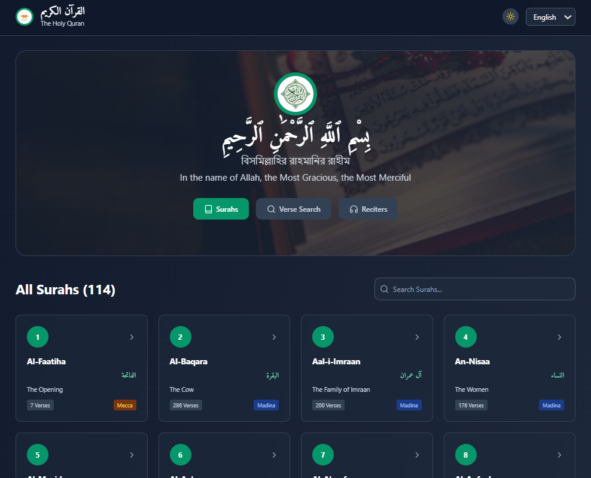

# Holy Quran App - القرآن الكريم

**A Beautiful and Modern Holy Quran Application**

*بِسْمِ ٱللَّهِ ٱلرَّحْمَٰنِ ٱلرَّحِيمِ*

---

## ✨ **Overview**

Welcome to Al-Quran, a beautifully designed web application that brings the divine guidance of the Holy Quran to your fingertips. This app allows users to read, listen, and reflect upon the final revelation from Allah, preserved in its original form. With a user-friendly interface and rich features, it aims to provide an immersive and accessible experience for exploring the Quran.

---

## 🌟 **Current Features**

### 📚 **Complete Quran Access**
- **All 114 Surahs** - Complete Holy Quran with authentic text
- **Verse Display** - All verses with proper Arabic text and translations
- **Surah Information** - Revelation place (Mecca/Madina) and verse count
- **Beautiful Layout** - Islamic-inspired design with proper typography

### 🌍 **Multi-Language Support**
- **Arabic (العربية)** - Original text with proper formatting
- **English** - Clear translations
- **Bengali (বাংলা)** - Complete Bengali translation
- **Urdu (اردو)** - Full Urdu translation with RTL support

### 🎵 **Audio Recitation**
- **5 Featured Reciters**:
  - Mishary Rashid Al Afasy
  - Abu Bakr Al Shatri
  - Nasser Al Qatami
  - Yasser Al Dosari
  - Hani Ar Rifai
- **Full Surah Audio** - Complete chapter recitations
- **Audio Controls** - Play/pause functionality

### 🔍 **Search Features**
- **Surah Search** - Find chapters by name or translation
- **Verse Search** - Search specific verses by Surah and Ayah number

### 🎨 **Design & Interface**
- **Islamic Aesthetics** - Inspired by Islamic architecture
- **Dark/Light Mode** - Toggle between themes

---

## 🎯 **Main Sections**

### 1. **📖 All Surahs**
- Grid view of all 114 Surahs
- Arabic names with translations
- Search functionality
- Click to view full Surah content

### 2. **🔍 Verse Search**
- Search by Surah number and verse number
- View specific verses with translations
- Audio playback for searched verses

### 3. **🎵 Reciters**
- Featured reciter profiles
- country information
- Easy access to recitations

### 4. **📄 Surah Details**
- Complete Surah view with all verses
- Multiple language translations
- Audio controls for each Surah
- Beautiful header with Surah information

---

## 🎨 **Technical Features**

- **React Framework** - Modern, responsive interface
- **Tailwind CSS v3** - Beautiful styling with Islamic design
- **API Integration** - Real-time Quran data
- **Arabic Typography** - Proper font rendering for Arabic text
- **RTL Support** - Right-to-left text for Arabic and Urdu

---

## 🌟 **User Experience**

- **Peaceful Design** - Calming emerald color scheme
- **Easy Navigation** - Intuitive interface
- **Fast Loading** - Optimized performance
- **Islamic Elements** - Respectful presentation of sacred content
- **Accessibility** - Keyboard navigation and proper contrast

---

رَبَّنَا تَقَبَّلْ مِنَّا ۖ إِنَّكَ أَنتَ السَّمِيعُ الْعَلِيمُ

"Our Lord, accept [this] from us. Indeed You are the Hearing, the Knowing." - Al-Baqarah 2:127

